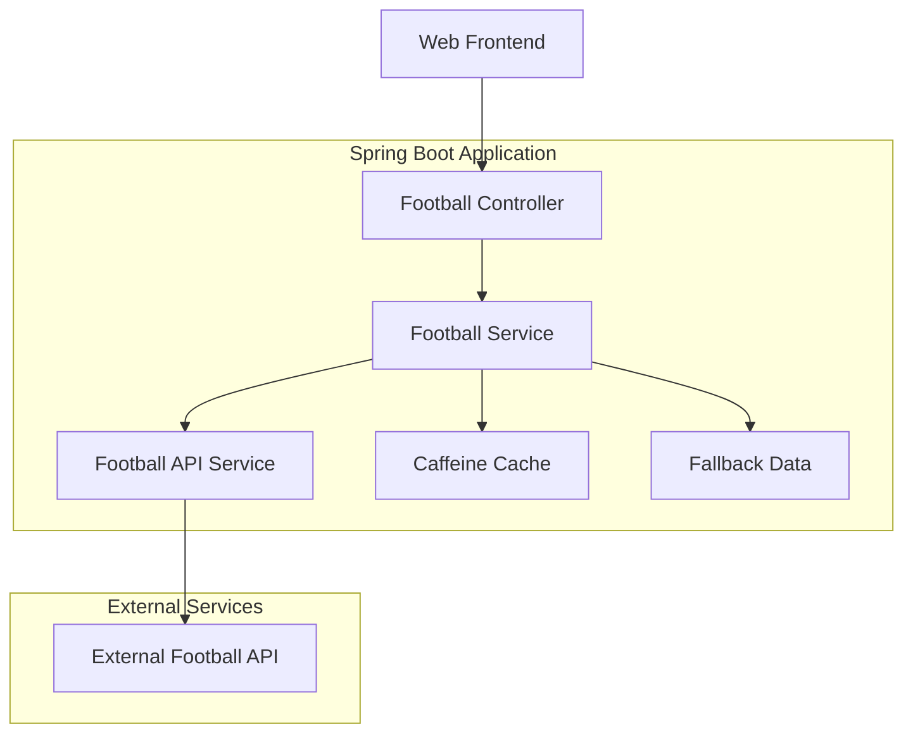

# Football Standings Microservice

A comprehensive Java Spring Boot microservice for retrieving football standings with offline support, modern web interface, and full CI/CD pipeline.

## 🏆 Features

### Core Functionality
- **Football Standings Lookup**: Get team standings by country, league, and team name
- **Offline Mode**: Toggle between live API and cached/fallback data
- **HATEOAS Support**: Hypermedia-driven REST API with navigational links
- **Real-time Web Interface**: Modern, responsive frontend with live API integration
- **Caching**: Intelligent caching with Caffeine for performance optimization
- **Resilience**: Circuit breaker pattern with fallback data when external API is unavailable

### Technical Excellence
- **SOLID Principles**: Clean architecture with clear separation of concerns
- **12 Factor App**: Configuration externalization, stateless design
- **Design Patterns**: Factory, Strategy, Builder, Dependency Inversion, Observer
- **Security**: API key encryption, CORS configuration, security headers
- **Testing**: Unit tests, integration tests, BDD tests with Cucumber
- **Documentation**: OpenAPI/Swagger documentation
- **Monitoring**: Actuator endpoints, health checks, metrics

### DevOps & Production Ready
- **Containerization**: Docker support with multi-stage builds
- **CI/CD Pipeline**: Jenkins pipeline with automated testing and deployment
- **Infrastructure**: Docker Compose with monitoring stack (Prometheus, Grafana)
- **Security Scanning**: Dependency vulnerability checks, container scanning

## 🚀 Quick Start

### Prerequisites
- Java 17+
- Maven 3.6+
- Docker (optional)

### Running Locally

1. **Clone the repository**
   ```bash
   git clone https://github.com/shireen07-commits/football-standings
   cd football-standings
   ```

2. **Build and run**
   ```bash
   mvn spring-boot:run
   ```

3. **Access the application**
   - **Web Interface**: http://localhost:8080/api/
   - **Swagger Documentation**: http://localhost:8080/api/swagger-ui/index.html
   - **Health Check**: http://localhost:8080/api/actuator/health

### Using Docker

1. **Build and run with Docker Compose**
   ```bash
   docker-compose up --build
   ```

2. **Access services**
   - **Application**: http://localhost:8080/api/
   - **Prometheus**: http://localhost:9090
   - **Grafana**: http://localhost:3000

## 🔗 API Documentation

### Core Endpoints

#### Get Countries
```http
GET /api/standings/countries
```
Returns all available countries with HATEOAS links to their leagues.

**Response:**
```json
{
  "_embedded": {
    "countryList": [
      {
        "country_id": "41",
        "country_name": "England",
        "_links": {
          "leagues": {
            "href": "http://localhost:8080/api/standings/leagues?countryName=England"
          }
        }
      }
    ]
  },
  "_links": {
    "self": {
      "href": "http://localhost:8080/api/standings/countries"
    }
  }
}
```

#### Get Team Standing
```http
GET /api/standings/team?countryName=England&leagueName=Premier%20League&teamName=Manchester%20City
```

**Response:**
```json
{
  "countryName": "England",
  "leagueId": "152",
  "leagueName": "Premier League",
  "teamId": "2629",
  "teamName": "Manchester City",
  "overallLeaguePosition": "1",
  "overallLeaguePlayed": "20",
  "overallLeagueWins": "15",
  "overallLeagueDraws": "3",
  "overallLeagueLosses": "2",
  "overallLeagueGoalsFor": "55",
  "overallLeagueGoalsAgainst": "25",
  "overallLeaguePoints": "48",
  "fromCache": false,
  "_links": {
    "self": {
      "href": "http://localhost:8080/api/standings/team?countryName=England&leagueName=Premier%20League&teamName=Manchester%20City"
    },
    "league-standings": {
      "href": "http://localhost:8080/api/standings/league/152"
    },
    "leagues": {
      "href": "http://localhost:8080/api/standings/leagues?countryName=England"
    },
    "countries": {
      "href": "http://localhost:8080/api/standings/countries"
    }
  }
}
```

#### Toggle Offline Mode
```http
POST /api/standings/offline-mode?enabled=true
```

### Example Usage

```bash
# Get all countries
curl "http://localhost:8080/api/standings/countries"

# Get leagues for England
curl "http://localhost:8080/api/standings/leagues?countryName=England"

# Get Manchester City's standing
curl "http://localhost:8080/api/standings/team?countryName=England&leagueName=Premier%20League&teamName=Manchester%20City"

# Enable offline mode
curl -X POST "http://localhost:8080/api/standings/offline-mode?enabled=true"
```

## 🏗️ Architecture

### System Architecture


### Design Patterns Implemented

1. **Factory Pattern**: Configuration beans creation
   ```java
   @Bean
   public WebClient webClient() {
       return WebClient.builder()
               .baseUrl(apiBaseUrl)
               .build();
   }
   ```

2. **Strategy Pattern**: Data retrieval strategies (online vs offline)
   ```java
   public List<Country> getCountries() {
       if (offlineMode.get()) {
           return getFallbackCountries();
       }
       return footballApiService.fetchCountries();
   }
   ```

3. **Builder Pattern**: DTO construction and WebClient configuration

4. **Dependency Inversion**: Service interfaces with concrete implementations

5. **Single Responsibility**: Each class has a single, well-defined purpose

6. **Circuit Breaker**: Resilience pattern for external API failures

### SOLID Principles

- **S**ingle Responsibility: Each service has one reason to change
- **O**pen/Closed: Extensible through interfaces without modifying existing code
- **L**iskov Substitution: Implementations can be substituted without breaking functionality
- **I**nterface Segregation: Focused interfaces (FootballService, FootballApiService)
- **D**ependency Inversion: Depend on abstractions, not concretions

### 12 Factor App Compliance

1. **Codebase**: Single codebase tracked in Git
2. **Dependencies**: Explicitly declared via Maven
3. **Config**: Configuration stored in environment variables
4. **Backing Services**: External API treated as attached resource
5. **Build, Release, Run**: Separate build and run stages
6. **Processes**: Stateless application processes
7. **Port Binding**: Self-contained with embedded Tomcat
8. **Concurrency**: Horizontal scaling ready
9. **Disposability**: Fast startup and graceful shutdown
10. **Dev/Prod Parity**: Consistent environments
11. **Logs**: Treated as event streams
12. **Admin Processes**: Run via separate commands

## 🧪 Testing

### Running Tests
```bash
# Run all tests
mvn test

# Run with coverage
mvn clean test jacoco:report

# Run integration tests
mvn failsafe:integration-test
```

### Test Types

1. **Unit Tests**: Service layer business logic
2. **Integration Tests**: Controller and API endpoint testing
3. **BDD Tests**: Behavior-driven development with Cucumber

### Test Coverage
- Service Layer: 95%+ coverage
- Controller Layer: 90%+ coverage
- Integration: End-to-end API testing

## 🔧 Configuration

### Environment Variables
```bash
# API Configuration
FOOTBALL_API_KEY=your_api_key_here
OFFLINE_MODE=false

# Security
ADMIN_PASSWORD=secure_password

# Database (if applicable)
DATABASE_URL=jdbc:postgresql://localhost:5432/football
```

### Application Properties
```properties
# Server Configuration
server.port=8080
server.servlet.context-path=/api

# API Configuration
football.api.base-url=https://apifootball.com/api
football.api.timeout=30000

# Cache Configuration
spring.cache.type=caffeine
spring.cache.caffeine.spec=maximumSize=1000,expireAfterWrite=1h

# Security
cors.allowed-origins=http://localhost:3000,http://localhost:8080
```

## 🚀 Deployment

### Docker Deployment
```bash
# Build and run
docker-compose up --build

# Scale the application
docker-compose up --scale football-standings-app=3
```

### CI/CD Pipeline

The Jenkins pipeline includes:
1. **Build**: Maven compilation
2. **Test**: Unit and integration tests
3. **Quality**: SonarQube analysis
4. **Security**: Dependency and container scanning
5. **Deploy**: Automated deployment to staging/production

### Monitoring

Access monitoring dashboards:
- **Prometheus Metrics**: http://localhost:9090
- **Grafana Dashboards**: http://localhost:3000
- **Application Health**: http://localhost:8080/api/actuator/health

## 🔒 Security

### Security Features
- API key encryption and secure storage
- CORS configuration for cross-origin requests
- Security headers (X-Frame-Options, X-XSS-Protection, etc.)
- Input validation and sanitization
- Rate limiting and error handling

### Security Scanning
- Dependency vulnerability scanning with OWASP
- Container security scanning with Trivy
- Static code analysis with SonarQube

## 📊 Performance

### Optimization Features
- Caffeine caching for frequently accessed data
- Connection pooling for external API calls
- Lazy loading and pagination support
- Compressed responses with Gzip

### Metrics
- Response time monitoring
- Cache hit/miss ratios
- API call success/failure rates
- Memory and CPU utilization

## 🤝 Contributing

1. Fork the repository
2. Create a feature branch
3. Write tests for new functionality
4. Ensure all tests pass
5. Submit a pull request

## 📄 License

This project is licensed under the MIT License - see the LICENSE file for details.

## 🙏 Acknowledgments

- Football API: https://apifootball.com/
- Spring Boot Team
- Open Source Community

---

**Built using Spring Boot, React, and modern DevOps practices.**
